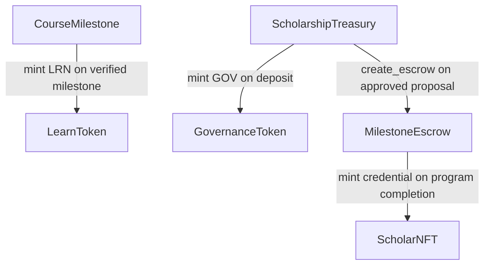

# LearnVault Smart Contract Reference

## Contract Overview

| Contract              | Language     | Purpose                                                                                    |
| --------------------- | ------------ | ------------------------------------------------------------------------------------------ |
| `LearnToken`          | Soroban/Rust | Soulbound reputation token (LRN) — minted on milestone completion, non-transferable        |
| `GovernanceToken`     | Soroban/Rust | Transferable DAO voting token (GOV) — minted to donors on deposit, earned by top learners  |
| `CourseMilestone`     | Soroban/Rust | Tracks learner progress per course, triggers LRN minting on verified checkpoint completion |
| `ScholarshipTreasury` | Soroban/Rust | Holds donor USDC funds, mints GOV to donors, creates escrows for approved proposals        |
| `MilestoneEscrow`     | Soroban/Rust | Manages tranche disbursements to scholars, returns unspent funds after 30-day inactivity   |
| `ScholarNFT`          | Soroban/Rust | Soulbound credential NFT minted to scholars who complete their funded program              |
| `UpgradeTimelockVault`| Soroban/Rust | Isolated vault for secure contract upgrade timelocking with governance-controlled execution |

---

## Contract Interaction Diagram

**Interaction summary:**

- `CourseMilestone` → `LearnToken`: calls `mint` when a learner's checkpoint is
  verified
- `ScholarshipTreasury` → `GovernanceToken`: calls `mint` proportional to a
  donor's USDC deposit
- `ScholarshipTreasury` → `MilestoneEscrow`: calls `create_escrow` when a
  scholarship proposal passes DAO vote
- `MilestoneEscrow` → `ScholarNFT`: calls `mint` when a scholar completes all
  funded milestones

---

## Deployment Order

Contracts must be deployed in this order due to cross-contract dependencies:

1. **`LearnToken`** — no dependencies
2. **`GovernanceToken`** — no dependencies
3. **`ScholarNFT`** — no dependencies
4. **`UpgradeTimelockVault`** — no dependencies
5. **`CourseMilestone`** — requires `LearnToken` address
6. **`ScholarshipTreasury`** — requires `GovernanceToken` address
7. **`MilestoneEscrow`** — requires `ScholarshipTreasury` and `ScholarNFT`
   addresses

---

## Testnet Addresses

> Fill in after deployment to Stellar Testnet.

| Contract              | Testnet Address |
| --------------------- | --------------- |
| `LearnToken`          | —               |
| `GovernanceToken`     | —               |
| `CourseMilestone`     | —               |
| `ScholarshipTreasury` | —               |
| `MilestoneEscrow`     | —               |
| `ScholarNFT`          | —               |
| `UpgradeTimelockVault`| —               |

---

## Upgrade Timelock Vault

The `UpgradeTimelockVault` implements a dedicated vault pattern for secure contract upgrades with timelock enforcement.

### Security Model

The timelock vault provides the following security guarantees:

1. **Isolated Storage**: Upgrade proposals are stored separately from governance logic, preventing accidental modifications or exploits in the governance contract from affecting queued upgrades.

2. **Timelock Enforcement**: All upgrades must wait for a mandatory timelock period (default 48 hours) before execution, providing time for community review and potential cancellation.

3. **Admin Control**: Only the vault admin can queue or cancel upgrades, ensuring centralized control during the initial deployment phase.

4. **Event-Driven Transparency**: All operations (queue, execute, cancel) emit events for full transparency and monitoring.

5. **Cancellation Capability**: Queued upgrades can be cancelled by the admin at any time during the timelock period, providing a safety mechanism for discovered issues.

### Upgrade Flow

1. **Queue**: Governance contract calls `queue_upgrade()` after proposal approval
2. **Wait**: Community monitors the queued upgrade during timelock period
3. **Execute**: After timelock expires, governance contract calls `execute_upgrade()` to retrieve the WASM hash and perform the upgrade
4. **Cancel**: Admin can cancel the upgrade at any time before execution

### Integration with Governance

The vault is designed to be used by the governance system:

- The `ScholarshipTreasury` contract would be extended to handle upgrade proposals
- Upon approval, it calls `vault.queue_upgrade(contract, wasm_hash)`
- After timelock, it calls `vault.execute_upgrade(contract)` and performs the actual upgrade
- The vault enforces the timelock and provides isolated storage
